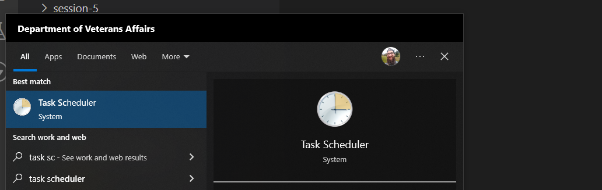
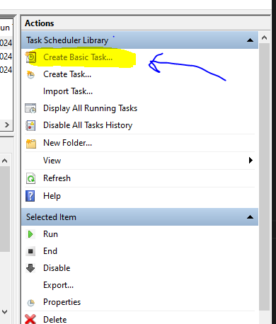
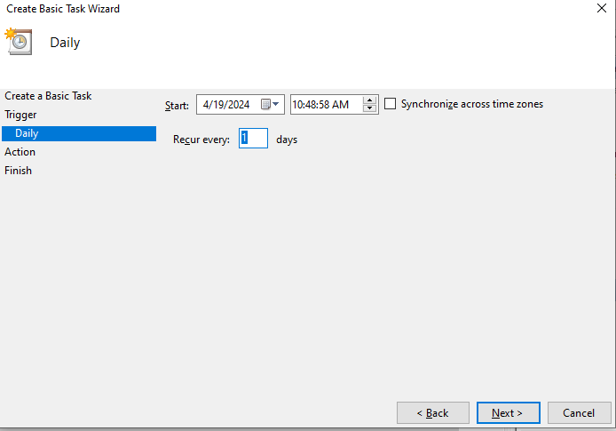
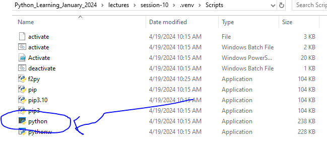
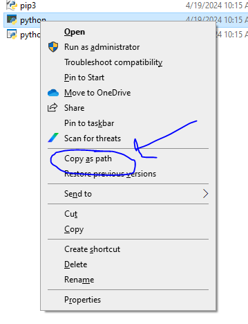
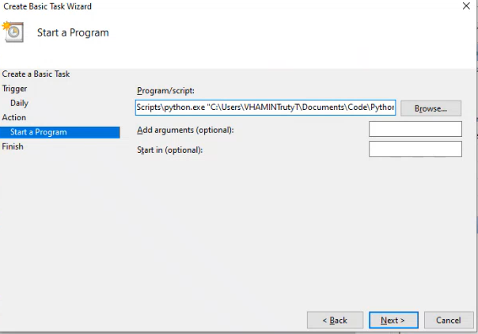
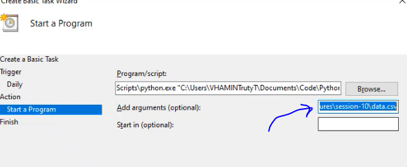
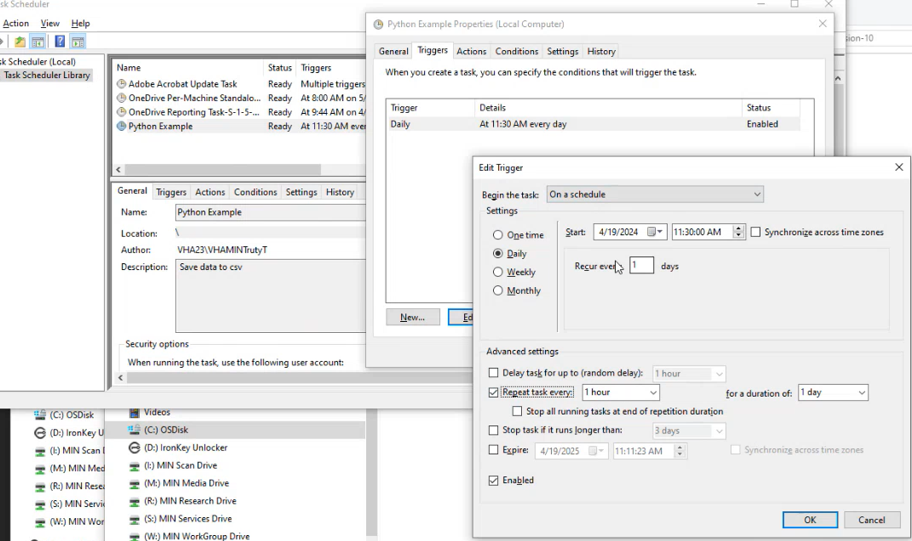

## Automate file creation and appending in Windows

1. Clone this repo down on your machine 
``` git clone [this repo url]```   

2. and create venv (or can use the base python install if you choose)
``` python -m .venv venv``` 

3. Test this file an edit to your needs

4. Search for Task Scheduler in Windows

> 

5. On right side of window click Create Basic Task

> 

6. Name Task and select the trigger time frame, on this the smallest amount of time is daily, but can edit to get more advance time later

> 

7. Select action as "Start Program"

8. Grab Absolute path of the python, script, and data folder you want to use.
- If venv, look in the .venv/Scripts folder to get the python exe
- 
- Right click while holding "SHIFT" and select "COPY PATH"

> 

> 

9. Put in python exe and the python file in the program/script box:

> 

9. Put the absolute path of the data csv in the "Add Arguments" box:

> 

10. Click Finish, your task is schedule to run every day

11. If you want your task to run more often, select your task in the viewer and naivgate to trigger, and now you can edit trigger to run more often, Ex. repeat every hour:

> 